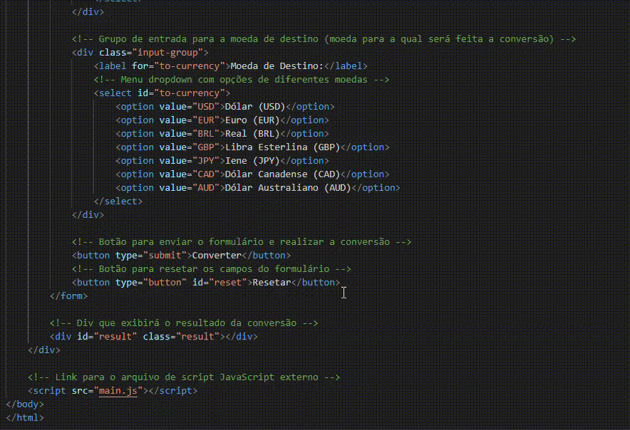
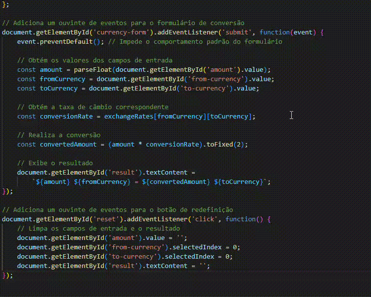

# Indice

[Descricao](#descrição)

[funcionalidades](#funcionalidades)

[funcoes](#funções)

[tecnologias_utilizadas](#tecnologias-utilizadas)

[gif_demonstrativo](#gif-demonstrativo)

[autor](#autor)

## Conversor de Moedas Personalizado:
# Descrição:

    Aplicação web intuitiva para conversão de moedas, com design moderno e funcionalidades avançadas.

## Funcionalidades:

    Conversão entre diversas moedas
    Histórico de conversões
    Gráficos de variação das taxas de câmbio
    Temas claro e escuro
    Design responsivo

## Clone o repositório: 

    clone esse repositório: https://github.com/luan18alencar/Conversor_Simples
    Abra o projeto em seu editor de código preferido.
    Instale as dependências (se houver).
    Inicie um servidor local.
    
## Uso:

    Selecione a moeda de origem e de destino.
    Insira o valor a ser convertido.
    Clique no botão "Converter".
    Contribuições:
    Se você quiser contribuir para este projeto, fique à vontade para abrir um pull request.

## Imagens demonstrativas:

## HTML

## CSS

## JavaScript

## Tecnologias utilizadas:
 
 
* [<code></code>](https://developer.mozilla.org/pt-BR/docs/Web/HTML)
* [<code></code>](https://github.com/)
* [<code></code>](https://git-scm.com/)
* [<code></code>](https://code.visualstudio.com/)
* [<code></code>](https://fontawesome.com/versions)
 

## Autor:
|  [ Luan Alencar](https://github.com/luan18alencar) |  
| :---: |

